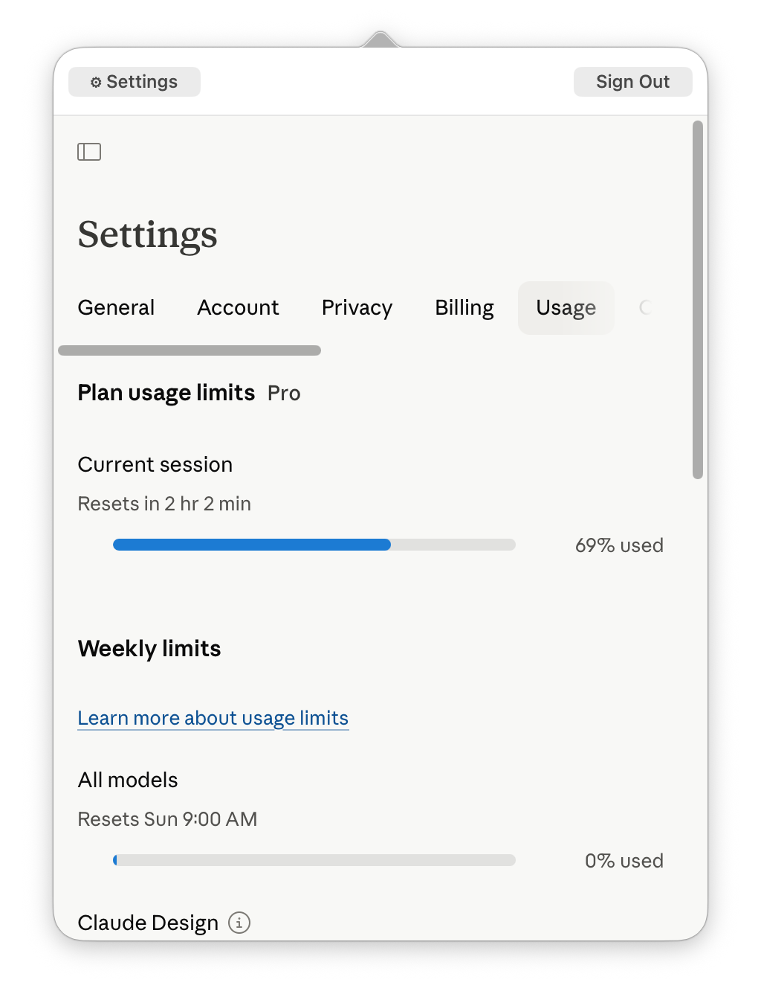

# ClaudeUsage

A lightweight macOS menu bar app for monitoring your **Claude Pro plan usage** at a glance — without leaving whatever you're working on.

Click the gauge icon, check your limits, click away.

---

## Features

- **Menu bar popover** — the full claude.ai page in a slim dropdown, no extra window clutter
- **Multi-account support** — a local config file holds your accounts; one click fills your email on the login page
- **Account label** — your display name sits next to the gauge icon so you always know which account is active
- **Smart login flow** — the popover never reloads mid-authentication; a "Sign in as" bar appears automatically on the login page
- **Nav bar on authenticated pages** — quick ⚙ Settings and Sign Out buttons at the top of every authenticated page
- **Session persistence** — cookies survive app restarts (WKWebView default store); log in once per account
- **No scraping, no polling** — identity comes from your local config file, not DOM parsing

---

## Screenshot


<!-- Add your own screenshot to docs/screenshot.png -->

---

## Requirements

- macOS 12 or later
- Xcode Command Line Tools

```bash
xcode-select --install
```

---

## Build & install

```bash
git clone https://github.com/YOUR_USERNAME/ClaudeUsage.git
cd ClaudeUsage
bash build.sh
xattr -cr ClaudeUsage.app && open ClaudeUsage.app
```

> **First launch:** macOS Gatekeeper will block an unsigned app. The `xattr` command removes the quarantine flag.  
> Alternatively: right-click `ClaudeUsage.app` → **Open** → **Open**.

### Auto-start at login

**System Settings → General → Login Items → +** → select `ClaudeUsage.app`

---

## Configuration

On first launch the app creates `~/.claudeusage.json` with placeholder entries.  
Edit it in any text editor (right-click the menu bar icon → **Edit Config File…**):

```json
{
  "accounts": [
    { "email": "personal@example.com", "display": "Personal" },
    { "email": "work@clientco.com",    "display": "Client Co" }
  ],
  "lastUsedIndex": 0
}
```

| Key | Description |
|-----|-------------|
| `email` | The email address you use to log into claude.ai |
| `display` | Short label shown in the menu bar (keep it under ~12 chars) |
| `lastUsedIndex` | Index of the account to show on launch (updated automatically) |

---

## Usage

### Viewing usage
Left-click the gauge icon → popover opens on the claude.ai home page.  
Use the **⚙ Settings** button at the top → navigate to the **Usage** tab.

### Logging in (first time or after sign-out)
1. Left-click the gauge icon
2. The login page appears with a **"Sign in as:"** bar at the top
3. Click your account button → your email is filled in automatically
4. Complete the magic-link flow as usual

### Switching accounts
Right-click → **Switch Account** → choose an account → the login page opens with the account bar ready.

### Signing out
Click **Sign Out** in the nav bar (top of the popover) — this clears the embedded session and returns to the login page.

---

## How it works

The app is a single Swift file (~300 lines) using:

- **`NSStatusItem`** — the menu bar icon and label
- **`WKWebView`** — embeds claude.ai directly; uses the default persistent data store so cookies survive restarts
- **`NSPopover`** — the dropdown container, closes on click-outside
- A plain **JSON config file** at `~/.claudeusage.json` for account identity

No Electron, no npm, no background services. The compiled binary is ~200 KB.

---

## Roadmap

- [ ] Anthropic API token usage + spend (pending a public usage API for claude.ai Pro accounts)
- [ ] Per-account usage history / logging
- [ ] Notification when weekly usage exceeds a configurable threshold
- [ ] Direct deep-link to the Usage tab on open

---

## Contributing

Pull requests and issues welcome. The entire app is `ClaudeUsage.swift` — fork, tweak, and open a PR.

If Anthropic ever ships a public API for claude.ai Pro usage data, that would unlock proper dashboard features without any web embedding.

---

## License

MIT — see [LICENSE](LICENSE).
